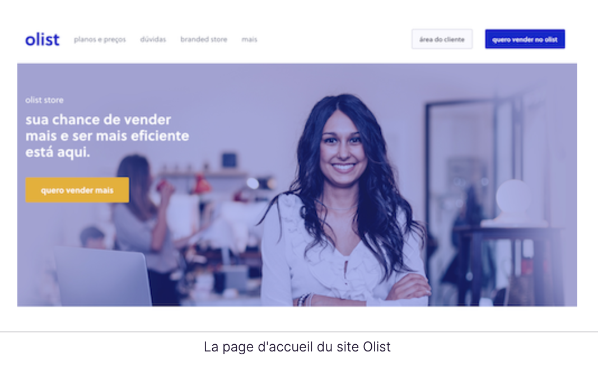
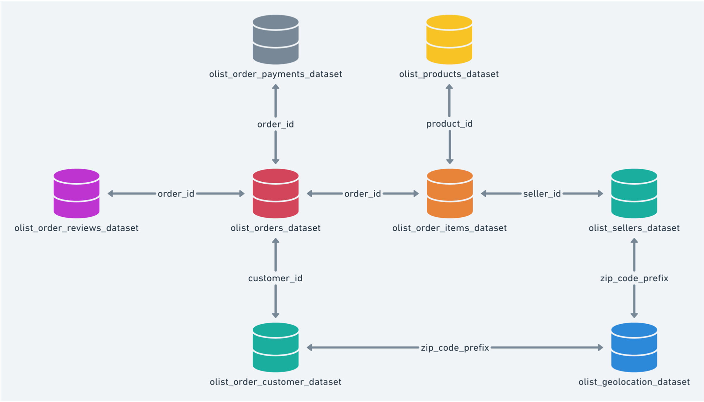
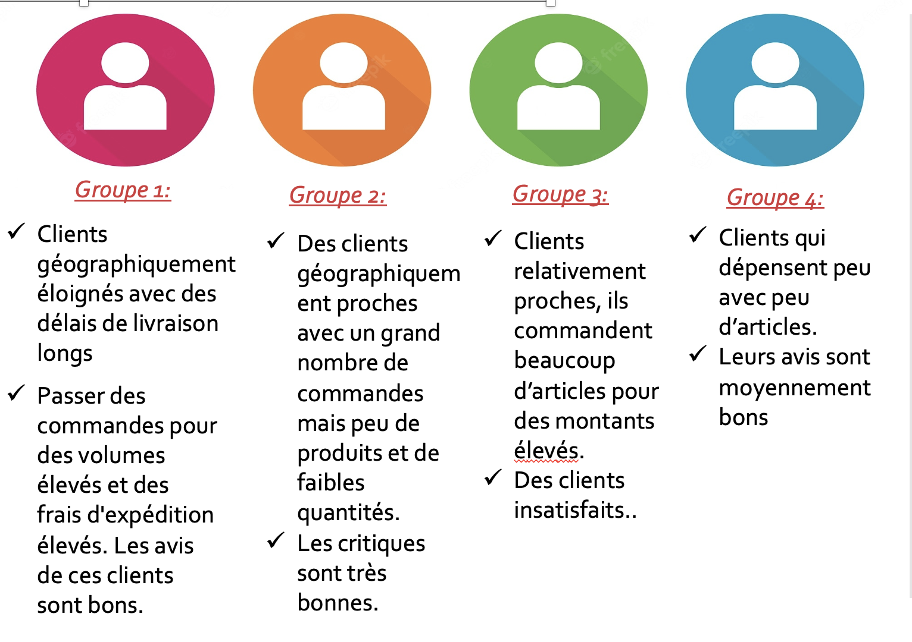
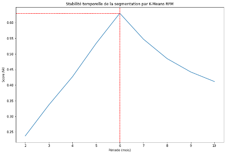

# Segmentez des clients d'un site e-commerce
## Projet5-Openclassrooms
&nbsp;
**Author:** Gulsum Kapanoglu
***

## Description de projet!
Olist est une entreprise brésilienne qui propose une solution de vente sur les marketplaces en ligne. Elle voudrait une segmentation des clients pour ses équipes d'e-commerce et aussi pour qu’elles pourront utiliser au quotidien pour leurs campagnes de communication.

## Objectif de projets
L'objectif de ce projet est de comprendre différents types d'utilisateurs à travers leur comportement et leurs données personnelles.
La société voudra aussi qu’une proposition de contrat de maintenance basée sur une analyse de la stabilité des segments au cours du temps.

## Data
Pour cette mission, Olist fournit une base de données anonymisée comportant des informations sur l’historique de commandes, les produits achetés, les commentaires de satisfaction, et la localisation des clients depuis janvier 2017. Source des données : https://www.kaggle.com/olistbr/brazilian-ecommerce

## Méthodes
Mise en place d'un modèle d'apprentissage non supervisé pour réaliser une segmentation client pour un site de e commerce
Création d'un pipeline de nettoyage des données et d'identification des features importantes
Création de nouvelles features
Essais de clustering par différents algorithmes:
-Algorithme K-means 
-Agglomerative clustering 
-Clustering par DBSCAN 
-Segmentation RFM
-Analyse des résultats et explicabilité
-Optimisation des hyperparamètres
-Visualisation des données

## Profils des clients

## Conclusion
Dans le but d'établir un contrat de maintenance de l'algorithme de segmentation client, nous devons tester sa stabilité́ dans le temps. 
Pour déterminer le moment où les clients changent de cluster, nous allons itérer le K-Means sur toute la période des commandes (23 mois) avec des deltas de 2 mois et calculer le score ARI. 

Segmentation RFM avec un K-means à renouveler tous les 6 mois. 

## Pour plus d'informations

Veuillez consulter mon analyse complète dans [mon Jupyter Notebook](./Notebook_essais.ipynb) ou ma [présentation](./Presentation.pdf). Pour toute question supplémentaire, veuillez contacter avec moi à gulsumkapanoglu@gmail.com.

Ce travail a été réalisé lors du projet 5 de ma formation Centrale Supèlec et OpenClassrooms de Data Scientist.
## Compétences évaluées
- Adapter les hyperparamètres d'un algorithme non supervisé afin de l'améliorer.
- Évaluer les performances d’un modèle d'apprentissage non supervisé.
- Transformer les variables pertinentes d'un modèle d'apprentissage non supervisé.
- Mettre en place le modèle d'apprentissage non supervisé adapté au problème métier.
